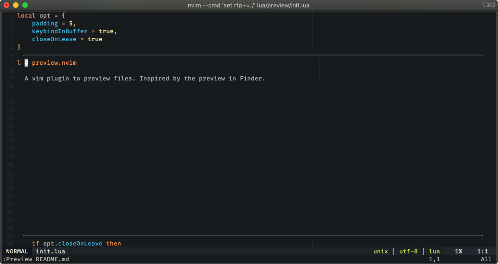

# preview.nvim

A vim plugin to preview files. Inspired by the preview in Finder.



## Install

Use your favourite plugin manager

## Setup

```lua
require('preview').init {
	-- put your opts here
	-- or leave blank to use defaults

	padding = 5,               -- padding around preview
	keybindInBuffer = true,    -- whether to register keybindings in preview buffer
	closeOnLeave = true,       -- whether to close preview on leaving the preview buffer
}
```

## Features

### Keybindings

Right now, there is one keybinding in the preview buffer:

-  `q`: close the preview buffer

These keybindings can be disabled. See [Setup](#setup)


### Auto-close

When you leave the preview buffer, the preview buffer will be closed
automatically. 

This can be disabled. See [Setup](#setup)

## License

Copyright (c) Siddharth Shyniben. Distributed under the same terms as Vim itself. See `:help license`.
